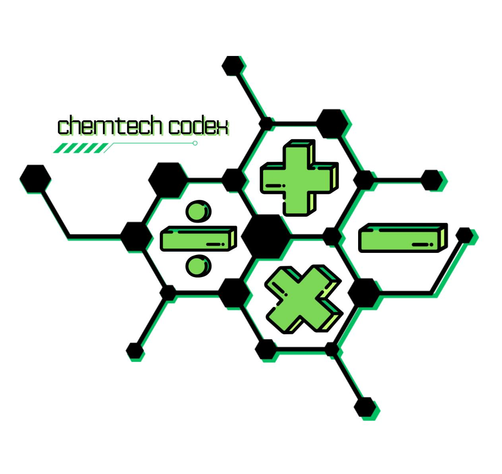

# ChemTech Codex


[](https://github.com/astral-sh/ruff)

ChemTech Codex is a simple CLI-based calculator that solves and integrates General Chemistry 2 concepts. It takes inputs from the user and uses predetermined formulas to calculate values. The following General Chemistry 2 topics are covered:

1. **Thermochemistry** - Standard Enthalpy, Standard Entropy Change / System Entropy, Entropy of The Surroundings, Entropy of The Universe.
2. **Chemical Kinetics** - First Order Reactions
3. **Chemical Equilibrium** - Chemical Equilibrium Constants Using Molarities and Pressures
4. **Acids and Bases** - Potential of Hydrogen Ions and Hydroxide Ions

## Usage

```bash
python3 main.py
```

### Example

Here's a simple example of calculating the standard enthalpy of the reaction, standard entropy of the reaction, and entropy of the universe of the equation N₂ + 3H₂ → 2NH₃:


---


# De La Salle Santiago Zobel School

## Senior High School (Grade 12)

The source code for my performance task for **Empowerment Technologies** || A.Y. 2023 - 2024 (Term 3)

- **Title**: ChemTech Codex
- **Instructor**: Neil Christian Capanzana
- **Groupmates**: 12G-Chem-Group-4
  - Patrick Gabriel Cabero Halili (s2011079)
  - Allen Conner Cole Hizon (s2011090)
  - Juan Jose Bachmann Lacson (s2011073)
  - Louis Raphael Villaluna Panaligan (s2018402)
  - Anton Jefferson Lachica Pangilinan (s2012385)
  - Josef Benedict Aguirre Plata (s2022428)
